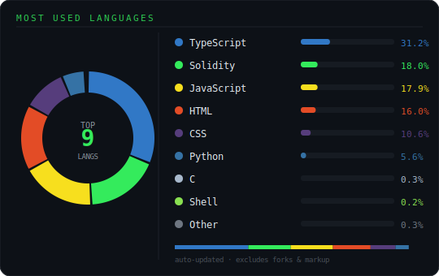

<div align="center">
  
</div>

<div align="center">
  
</div>

<br/>

<div align="center">

[](mailto:motsieashley31@gmail.com)
[](https://www.linkedin.com/in/ashley-k-motsie-718686263/)
[](https://ashleydevhub.vercel.app/)
[](https://www.youtube.com/@Ashley.Programmer)

</div>

<div align="center">

[](https://user-badge.committers.top/south_africa/KodEx-SA)
[](https://user-badge.committers.top/south_africa_public/KodEx-SA)
[](https://user-badge.committers.top/south_africa_private/KodEx-SA)


</div>

<div align="center"></div>

## 👨‍💻 About Me

```typescript
const ashley: Developer = {
  name:     "Ashley K Motsie",
  location: "Rustenburg, South Africa 🇿🇦",
  roles: [
    "Jr Software Developer & IT Technician @ Eullafied Tech Solutions",
    "Web Developer & Graphic Designer @ Maps Media Productions",
  ],
  stack: {
    frontend:  ["Next.js 15", "React", "TypeScript", "Tailwind CSS", "Vite"],
    backend:   ["Node.js", "Python", "PostgreSQL", "Supabase", "Prisma"],
    ai:        ["Groq API", "LangChain", "OpenAI", "LiveKit"],
    devops:    ["AWS", "Docker", "Vercel", "GitHub Actions"],
  },
  building:  ["Property Management Platform", "Smith AI Chatbot", "SafeCircle Safety App"],
  available: true,
  motto:     "Transforming ideas into scalable solutions 🚀",
};
```

<div align="center"></div>

## 🚀 Featured Projects

<div align="center">
<table>
<tr>

<td width="33%" align="center">


<br/><br/>
<b>🤖 Smith AI Chatbot</b>
<br/><br/>
<sub>
A production-grade AI assistant powered by Groq API and LangChain. Features real-time streaming responses, conversation memory, and a clean chat UI built with React and TypeScript.
</sub>
<br/><br/>


</td>

<td width="33%" align="center">


<br/><br/>
<b>🛡️ SafeCircle Safety App</b>
<br/><br/>
<sub>
A real-time personal safety platform enabling location sharing, emergency alerts, and trusted contact circles. Built with Next.js 15 and Supabase for live data sync and instant notifications.
</sub>
<br/><br/>


</td>

<td width="33%" align="center">


<br/><br/>
<b>💬 ReactJS AI Chatbot</b>
<br/><br/>
<sub>
A lightweight embedded chatbot widget built in React for quick client deployment. Integrates OpenAI for smart responses with customisable UI theming and zero-dependency embedding.
</sub>
<br/><br/>


</td>

</tr>
</table>
</div>

<div align="center"></div>

## ⚡ Tech Stack

<div align="center">

| Layer | Technologies |
|---|---|
| **Frontend** |      |
| **Backend** |    |
| **Database** |    |
| **AI / ML** |     |
| **Cloud & DevOps** |     |

</div>

<div align="center"></div>

## 📈 Impact & Metrics

<div align="center">

| 🤖 | 🌐 | 👥 | ☁️ | 📅 |
|:---:|:---:|:---:|:---:|:---:|
| **2** | **5+** | **2** | **3+** | **3+** |
| Production AI Systems | Client Sites Delivered | Concurrent Roles | Cloud Platforms | Years Experience |
| Smith AI · ReactJS Chatbot | Live & in production | Across tech & AI firms | Vercel · Netlify · Render | Building & shipping |

</div>

<div align="center"></div>

## 📊 GitHub Stats

<div align="center">
  
  
</div>

<div align="center">
  
</div>

<div align="center"></div>

## 🌊 Coding Activity

<picture>
  <source media="(prefers-color-scheme: dark)" srcset="https://raw.githubusercontent.com/KodEx-SA/KodEx-SA/output/github-contribution-grid-snake-dark.svg" />
  <source media="(prefers-color-scheme: light)" srcset="https://raw.githubusercontent.com/KodEx-SA/KodEx-SA/output/github-contribution-grid-snake.svg" />
  
</picture>

<div align="center"></div>

<div align="center">

### 💼 Open to full-time roles, freelance & remote collaboration

*Currently based in Rustenburg, ZA · SAST (UTC+2) · Responds within 24hrs*

[](mailto:motsieashley31@gmail.com)
[](https://ashleydevhub.vercel.app/)
[](https://www.linkedin.com/in/ashley-k-motsie-718686263/)


</div>
