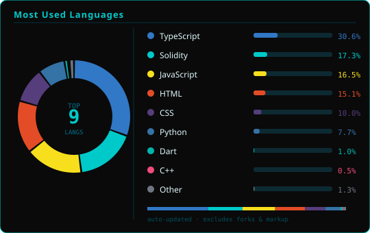

<div align="center">
  

  

  <br/>

  [](mailto:motsieashley31@gmail.com)
  [](https://www.linkedin.com/in/ashley-k-motsie-718686263/)
  [](https://ashleydevhub.vercel.app/)
  [](https://www.youtube.com/@Ashley.Programmer)

  [](https://user-badge.committers.top/south_africa/KodEx-SA)
  
</div>

<br/>

## `$ whoami`

I build full-stack web apps and AI-powered systems: voice assistants, chatbots, network tooling and Web3 apps. Most of what I ship is self-taught and production-facing, not just side projects.

```text
name       Ashley K Motsie
role       Software Developer & AI Engineer
location   Rustenburg, South Africa (SAST, UTC+2)
status     🟢 open to full-time remote roles, freelance & collaboration
learning   C, from the ground up
off-hours  poetry
reply      within 24 hrs
```

<br/>

## `$ history --experience`

<table>
  <tr>
    <td width="170" valign="top"><b>Ongoing</b></td>
    <td>
      <b>Web Developer & Graphic Designer</b> · Maps Media Productions<br/>
      <sub>Web development and graphic design across client sites and campaigns.</sub><br/>
      
    </td>
  </tr>
  <tr>
    <td valign="top"><b>Jul 2025 – May 2026</b></td>
    <td>
      <b>Software Developer & AI Engineer</b> · AI Global Networks<br/>
      <sub>Consulted on the AGN site (Groq-powered chatbot, Google Calendar booking) and built <code>webaudit</code>, a Playwright-based CLI auditing tool.</sub><br/>
      
    </td>
  </tr>
  <tr>
    <td valign="top"><b>Jun 2025 – May 2026</b></td>
    <td>
      <b>Jr Software Developer & IT Technician</b> · Eullafied Tech Solutions<br/>
      <sub>Shipped the ETS WiFi Captive Portal (Node.js, Express, SQLite, AES-256-GCM, JWT) and the Intern Management System monorepo, end to end.</sub><br/>
      
    </td>
  </tr>
</table>

<br/>

## `$ ls ~/projects`

<table>
  <tr>
    <td width="33%" valign="top">
      <br/><br/>
      <b>Clare</b><br/>
      <sub>Full voice-AI pipeline with persistent memory and a live Mission Control Dashboard. Runs on a free-tier stack: Deepgram STT, Groq LLM, Cartesia TTS and Silero VAD, backed by Supabase.</sub><br/><br/>
      
      
    </td>
    <td width="33%" valign="top">
      <br/><br/>
      <b>Trading-R1 Trace Market</b><br/>
      <sub>Reasoning-trace marketplace built for the Agora Agents Hackathon. Two Solidity contracts on Arc Testnet, a Next.js 15 frontend with wagmi/RainbowKit, and a Python agent pipeline on Groq + Pinata.</sub><br/><br/>
      
      
    </td>
    <td width="33%" valign="top">
      <br/><br/>
      <b>Driver Drowsiness & Fatigue Monitor</b><br/>
      <sub>Tracks eye closure, yawns and gaze to compute a real-time fatigue score and trigger high-risk alerts. Includes a dashboard for logging events and exporting driving data.</sub><br/><br/>
      
      
    </td>
  </tr>
</table>

More on my [portfolio](https://ashleydevhub.vercel.app/).

<br/>

## `$ cat stack.json`

| Layer | Technologies |
|---|---|
| **Frontend** |      |
| **Backend** |    |
| **Database** |    |
| **AI / ML** |      |
| **Web3** |   |
| **Cloud & DevOps** |     |

<br/>

## `$ git log --stats`

<div align="center">
  
  
  <br/><br/>
  
  <br/><br/>
  
</div>

<br/>

<div align="center">

### 💼 Let's build something

*Open to full-time remote roles, freelance work and collaboration.*

[](mailto:motsieashley31@gmail.com)
[](https://ashleydevhub.vercel.app/)
[](https://www.linkedin.com/in/ashley-k-motsie-718686263/)


</div>
